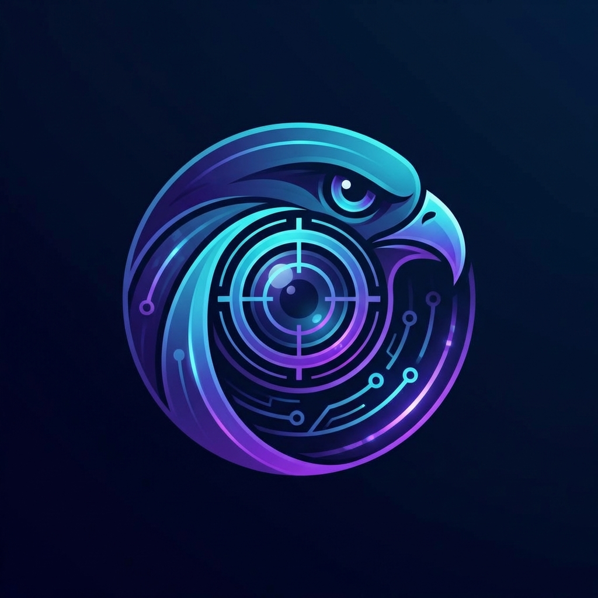

# 🦅 HawkLens

<p align="center">
  
</p>

<p align="center">
  <strong>Modern, High-Performance Multi-Platform Social OSINT & Analytics Framework</strong>
</p>

<p align="center">
  
  
  
</p>

---

## 🌟 Overview

HawkLens is a powerful OSINT (Open Source Intelligence) tool built in Golang, designed for speed, modularity, and depth. It concurrently scrapes and analyzes data from the world's largest social platforms, providing real-time sentiment analysis, topic modeling, and relationship clustering.

## 🚀 Features

- **⚡ High Concurrency**: Leverages Go routines and channels for lightning-fast multi-platform scanning.
- **🔌 Modular Architecture**: Easily extendable plugin system for adding new social media collectors.
- **📊 Real-time Analytics**: Built-in NLP engine for sentiment analysis and topic extraction.
- **🖥️ Premium Dashboard**: Stunning glassmorphism web interface for data visualization.
- **💾 Robust Persistence**: Seamless integration with PostgreSQL, Elasticsearch, and Redis.
- **📦 Multi-Export**: Export findings in JSON or CSV formats.

## 🛠️ Supported Platforms

- [x] **Twitter (X)**: Tweet extraction and user analysis.
- [x] **YouTube**: Video metadata and channel tracking.
- [x] **Reddit**: Post scraping and subreddit monitoring.
- [x] **Instagram**: Public post and caption analysis.
- [x] **TikTok**: Trending hashtag and public video tracking.

## 🏁 Getting Started

### Prerequisites

- Go 1.21+
- PostgreSQL
- Redis
- Elasticsearch

### Installation

```bash
# Clone the repository
git clone https://github.com/ismailtsdln/HawkLens.git
cd HawkLens

# Install dependencies
go mod download

# Build the binary
go build -o hawklens cmd/hawklens/main.go
```

### Usage

#### CLI Scan
```bash
./hawklens scan "keyword" --format json --output results.json
```

#### API Server
```bash
go run cmd/hawklens/main.go serve
```
Access the dashboard at `http://localhost:8080`.

## 📂 Project Structure

- `cmd/`: Application entry points (CLI & API).
- `internal/`: Core logic (analytics, database, plugins).
- `pkg/`: Shared libraries and interfaces.
- `dashboard/`: Web frontend assets.

## 🤝 Contributing

Contributions are welcome! Please see [CONTRIBUTING.md](CONTRIBUTING.md) for details.

## 📄 License

This project is licensed under the MIT License - see the [LICENSE](LICENSE) file for details.

---
<p align="center">Made with ❤️ by the HawkLens Team</p>
