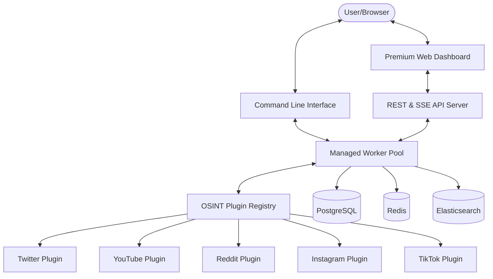

# HawkLens Architecture

HawkLens is designed for speed, modularity, and real-time insights. This document outlines the core components and data flow of the system.

## 🏗️ High-Level Component Diagram

## ⚡ Core Components

### 1. Managed Worker Pool (Engine)
The heart of HawkLens is the **Dispatcher**. It manages a finite pool of workers that process scan jobs concurrently. This prevents platform-specific delays from blocking the entire system and allows for efficient resource management.

- **Dispatcher**: Manages the job queue and results channel.
- **Workers**: Individual goroutines that fetch data from plugins.

### 2. Server-Sent Events (SSE) Pipeline
For the dashboard, HawkLens uses SSE to stream results. As soon as a worker retrieves data from a platform, it is pushed through the SSE stream to the connected client, providing a "live" intelligence feed.

### 3. Plugin Registry
The system uses an interface-based registry. Adding a new platform is as simple as implementing the `Plugin` interface and calling `Register()`. This decoupling allows for rapid expansion without touching the engine core.

## 📡 Data Flow

1. **Request**: User submits a query via CLI or Dashboard.
2. **Dispatch**: The Engine breaks the request into "Jobs" (one per registered plugin).
3. **Execution**: Workers pick up jobs and execute the `Fetch` method of the respective plugin.
4. **Analysis**: Results are passed through the NLP pipeline (Sentiment & Topics).
5. **Diffusion**: 
   - **Persistence**: Results are saved to PostgreSQL.
   - **Stream**: Results are sent to the user via SSE or CLI Table.
   - **Index**: Results are indexed in Elasticsearch for future search.

## 🛠️ Security & Reliability

- **Graceful Shutdown**: The API server and Dispatcher handle context cancellation to ensure clean exits.
- **Rate Limiting**: Integrated Redis logic to prevent API bans on target platforms.
- **Type Safety**: Built entirely in Golang with strong interface contracts.
